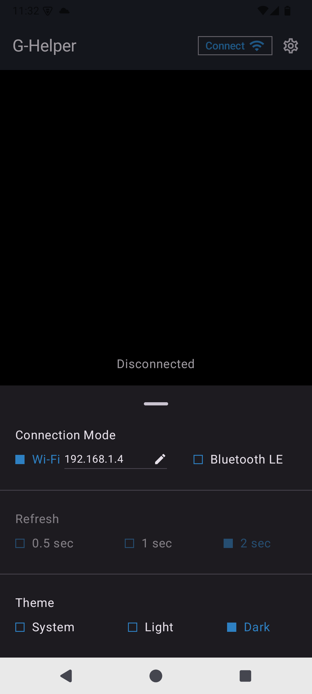
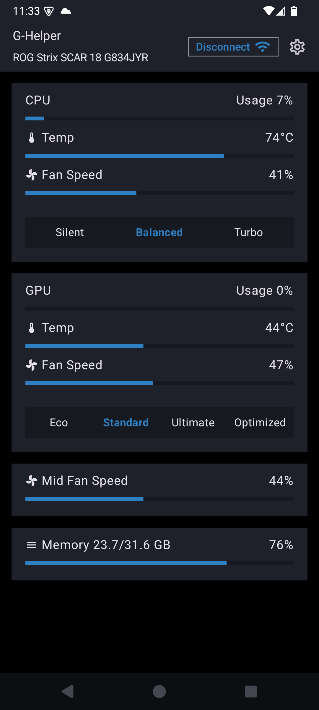
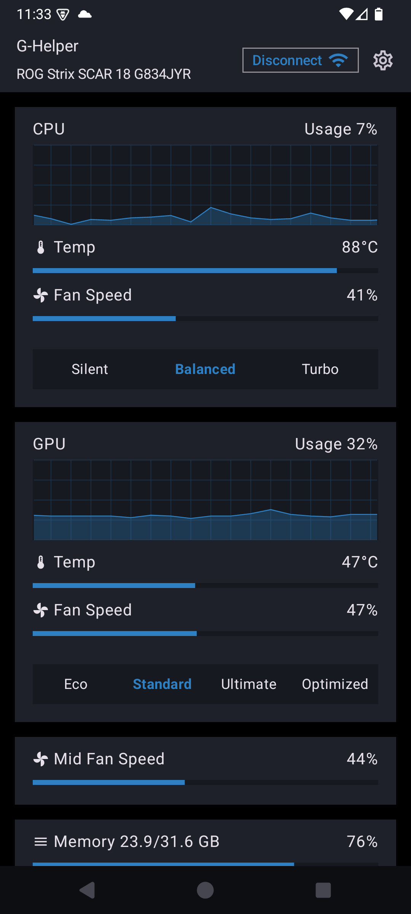

# g-helper-companion-app
The Android companion app for G-Helper connects with your PC to let you monitor system performance, switch performance profiles directly from your phone. Fast, lightweight, and designed for real-time control—perfect for managing your gaming laptop on the go.

## Screenshots 

&nbsp;&nbsp;&nbsp;&nbsp;
&nbsp;&nbsp;&nbsp;&nbsp;

